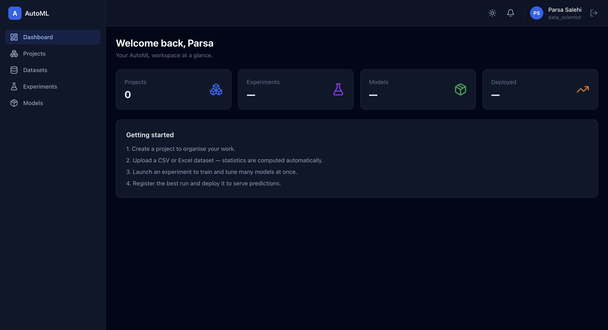

<div align="center">

# 🤖 Enterprise AutoML Platform

**Upload data → auto-EDA → feature engineering → train & tune dozens of models →
explain them → deploy → serve predictions.** A production-grade, full-stack
automated machine learning platform.

[](https://github.com/MParsa9011/enterprise-automl-platform/actions/workflows/backend-ci.yml)
[](https://github.com/MParsa9011/enterprise-automl-platform/actions/workflows/frontend-ci.yml)
[](https://github.com/MParsa9011/enterprise-automl-platform/actions/workflows/docs-ci.yml)
<br/>
[](backend/pyproject.toml)
[](https://fastapi.tiangolo.com)
[](https://react.dev)
[](https://www.typescriptlang.org)
[](docker-compose.yml)
[](LICENSE)
[](https://www.conventionalcommits.org)

[Features](#-features) · [Architecture](#-architecture) · [Tech Stack](#-tech-stack) · [Installation](#-installation) · [Docs](#-api-documentation) · [Roadmap](#-roadmap) · [Contributing](#-contributing)

</div>

---

## Overview

The **Enterprise AutoML Platform** lets data teams go from a raw CSV to a
deployed, explainable model without writing training code. It is built the way a
real product team would build it: a **clean, layered architecture**, strict typing
and linting, an extensive test suite, containerised services, CI/CD, and complete
documentation.

It is **not a tutorial project** — it is a coherent system of ~200 files with a
long history of small, atomic commits.

> **Status:** `v1.0.0` — feature-complete backend + frontend, containerised,
> documented and CI-gated. See [CHANGELOG.md](CHANGELOG.md).

---

## ✨ Features

- 🔐 **Auth & RBAC** — JWT access + refresh tokens with rotation & revocation,
  roles and fine-grained `resource:action` permissions.
- 🗂️ **Workspaces** — projects that own datasets, experiments and models.
- 📊 **Dataset management** — CSV / Excel / Parquet upload, **immutable
  versioning**, and automated statistical profiling (types, missingness,
  outliers via IQR, correlations).
- 🔎 **Automated EDA** — distributions, box & scatter plots, correlation heatmaps,
  emitted as interactive Plotly figure JSON.
- 🧪 **Feature engineering** — declarative pipeline of imputation, encoding,
  scaling, feature selection and PCA (scikit-learn `ColumnTransformer`).
- ⚙️ **AutoML** — trains **11 algorithms** across classification & regression with
  **Optuna** hyper-parameter optimisation, tracked in **MLflow**.
- 🧠 **Explainability** — SHAP (tree models) + permutation importance.
- 📦 **Model registry** — versioning, comparison, staged deployment (single
  production model per name).
- 🚀 **Prediction API** — send JSON records, get predictions + class probabilities
  from the exact persisted training pipeline (no training/serving skew).
- 🔔 **Ops** — in-app notifications and a structured, append-only audit trail.
- 🖥️ **Admin dashboard** — responsive React UI with dark mode, charts, tables and
  proper loading / error / empty states.

### Supported algorithms

`Random Forest` · `Extra Trees` · `Gradient Boosting` · `Logistic / Linear Regression`
· `SVM` · `KNN` · `Decision Tree` · `Gaussian Naive Bayes` · `XGBoost` · `LightGBM`
· `CatBoost` (boosting libraries degrade gracefully if unavailable).

---

## 🏛️ Architecture

Clean Architecture with the dependency rule pointing **inward**: the API depends on
services, services on repositories, repositories on the ORM.

```
              ┌────────────────────────────────────────────┐
  HTTP  ─────▶│  api/          routers · DI · middleware     │
              ├────────────────────────────────────────────┤
              │  services/     business logic (use-cases)    │
              ├────────────────────────────────────────────┤
              │  repositories/ data access (Repository)      │
              ├────────────────────────────────────────────┤
              │  models/       SQLAlchemy ORM                │
              └────────────────────────────────────────────┘
  supporting: schemas/ (DTOs) · storage/ (objects) · ml/ (framework-agnostic)
```

Training is **CPU-bound** so it never runs inside a request: the API enqueues a
**Celery** task; a worker drives the shared orchestration. Full diagrams (request
lifecycle, ER) are in [docs/architecture.md](docs/architecture.md) and
[docs/database.md](docs/database.md).

---

## 🧰 Tech Stack

| Layer | Technologies |
|-------|--------------|
| **API** | FastAPI · Pydantic v2 · Uvicorn / Gunicorn |
| **Data** | PostgreSQL · SQLAlchemy 2.0 (async) · Alembic |
| **Async** | Celery · Redis |
| **ML** | pandas · NumPy · scikit-learn · XGBoost · LightGBM · CatBoost · Optuna · SHAP · MLflow |
| **Viz** | Plotly |
| **Frontend** | React 18 · TypeScript · TailwindCSS · TanStack Query · React Router · React Hook Form |
| **Infra** | Docker · Docker Compose · Nginx · GitHub Actions |
| **Quality** | pytest · coverage · Ruff · Black · mypy · ESLint · Vitest |
| **Docs** | MkDocs (Material) · Swagger / OpenAPI |

---

## 📸 Screenshots

> Placeholder images — see [docs/screenshots](docs/screenshots) to add real captures.

| Login | Dashboard | Experiments |
|-------|-----------|-------------|
|  |  |  |

---

## 🎬 Demo

The full user journey, driven end-to-end against a live database:

```
register → create project → upload dataset (auto-profiled) → train AutoML
(3+ models) → explain best run → register + deploy model → predict (JSON in,
labels + probabilities out) → notifications + audit trail
```

Once running, explore the interactive API at **http://localhost:8000/docs** and the
dashboard at **http://localhost:8080** (Docker) or **http://localhost:5173** (dev).

---

## 🚀 Installation

### Prerequisites

- Python **3.12+**, Node **20+**
- Docker & Docker Compose (for the full stack)
- Optional (local ML libs on macOS): `brew install libomp`

### Option A — Docker Compose (recommended)

```bash
cp .env.example .env          # set SECRET_KEY + superuser credentials
docker compose up -d --build
```

| Service | URL |
|---------|-----|
| Frontend | http://localhost:8080 |
| API docs | http://localhost:8000/docs |
| MLflow | http://localhost:5000 |

The API container waits for Postgres, applies migrations and seeds the RBAC catalog
+ bootstrap superuser on start-up (idempotent).

### Backend setup (local)

```bash
cd backend
python -m venv .venv && source .venv/bin/activate
pip install -e ".[dev,ml]"

cp .env.example .env          # point POSTGRES_* at a local Postgres
alembic upgrade head          # create the schema
python -m app.db.init_db      # seed RBAC + superuser

uvicorn app.main:app --reload # http://localhost:8000/docs
```

Run the Celery worker (needs Redis):

```bash
celery -A app.worker.celery_app worker --loglevel=info
```

> **No queue infra?** Set `RUN_TRAINING_INLINE=true` to train experiments in-process.

### Frontend setup (local)

```bash
cd frontend
npm install
cp .env.example .env          # the dev server proxies /api to the backend
npm run dev                   # http://localhost:5173
```

### Running tests

```bash
# Backend (fast — runs on SQLite, no external services)
cd backend && pytest --cov=app

# Frontend
cd frontend && npm run test
```

### One-liners via Makefile

```bash
make install   # backend venv + deps
make run       # API with autoreload
make test      # backend suite with coverage
make lint      # ruff + black + mypy
make up        # docker compose up
```

---

## 📖 API Documentation

- **Swagger UI:** `/docs` · **ReDoc:** `/redoc` · **OpenAPI JSON:** `/api/v1/openapi.json`
- Endpoint overview and conventions: [docs/api.md](docs/api.md)
- Full docs site (MkDocs): `mkdocs serve` → http://localhost:8000

---

## 🗂️ Project structure

```
.
├── backend/                FastAPI application, ML engine, tests
│   ├── app/
│   │   ├── api/            HTTP layer (routers, deps, middleware, errors)
│   │   ├── core/          config, logging, security, permissions
│   │   ├── db/            engine, session, base, mixins, seed, init
│   │   ├── models/        SQLAlchemy ORM models
│   │   ├── repositories/  data access (Repository pattern)
│   │   ├── services/      business logic (use-cases)
│   │   ├── schemas/       Pydantic DTOs
│   │   ├── storage/       object-storage abstraction
│   │   ├── ml/            profiling, EDA, features, training, explain
│   │   └── worker/        Celery app + tasks
│   ├── alembic/           migrations
│   └── tests/             unit + integration suites
├── frontend/              Vite + React + TS + Tailwind dashboard
├── docs/                  MkDocs documentation + diagrams
├── .github/               CI workflows, issue/PR templates
├── docker-compose.yml     full stack (Postgres, Redis, MLflow, API, worker, web)
├── ROADMAP.md · PROJECT_STATUS.md · CHANGELOG.md
```

---

## 🗺️ Roadmap

All core milestones (M1–M9) are complete for `v1.0.0`. See [ROADMAP.md](ROADMAP.md).
Post-1.0 ideas (clustering, S3 storage, Playwright E2E, WebSocket training progress)
are tracked in [NEXT_TASK.md](NEXT_TASK.md).

---

## 🤝 Contributing

Contributions are welcome! Please read [CONTRIBUTING.md](CONTRIBUTING.md) and the
[Code of Conduct](CODE_OF_CONDUCT.md). In short:

1. Follow the vertical-slice workflow in [docs/development.md](docs/development.md).
2. Keep the quality gates green (`ruff`, `black`, `mypy`, `pytest`; `tsc`, `eslint`,
   `vitest`, `build`).
3. Use small, atomic [Conventional Commits](https://www.conventionalcommits.org).

Security issues? See [SECURITY.md](SECURITY.md). Need help? See [SUPPORT.md](SUPPORT.md).

---

## 📄 License

Distributed under the **MIT License**. See [LICENSE](LICENSE).

## 👤 Author

Built as a portfolio-grade, production-quality reference implementation by
[@MParsa9011](https://github.com/MParsa9011).

## 🙏 Acknowledgements

Standing on the shoulders of giants: [FastAPI](https://fastapi.tiangolo.com),
[SQLAlchemy](https://www.sqlalchemy.org), [scikit-learn](https://scikit-learn.org),
[Optuna](https://optuna.org), [SHAP](https://shap.readthedocs.io),
[MLflow](https://mlflow.org), [React](https://react.dev),
[TanStack Query](https://tanstack.com/query) and [TailwindCSS](https://tailwindcss.com).
