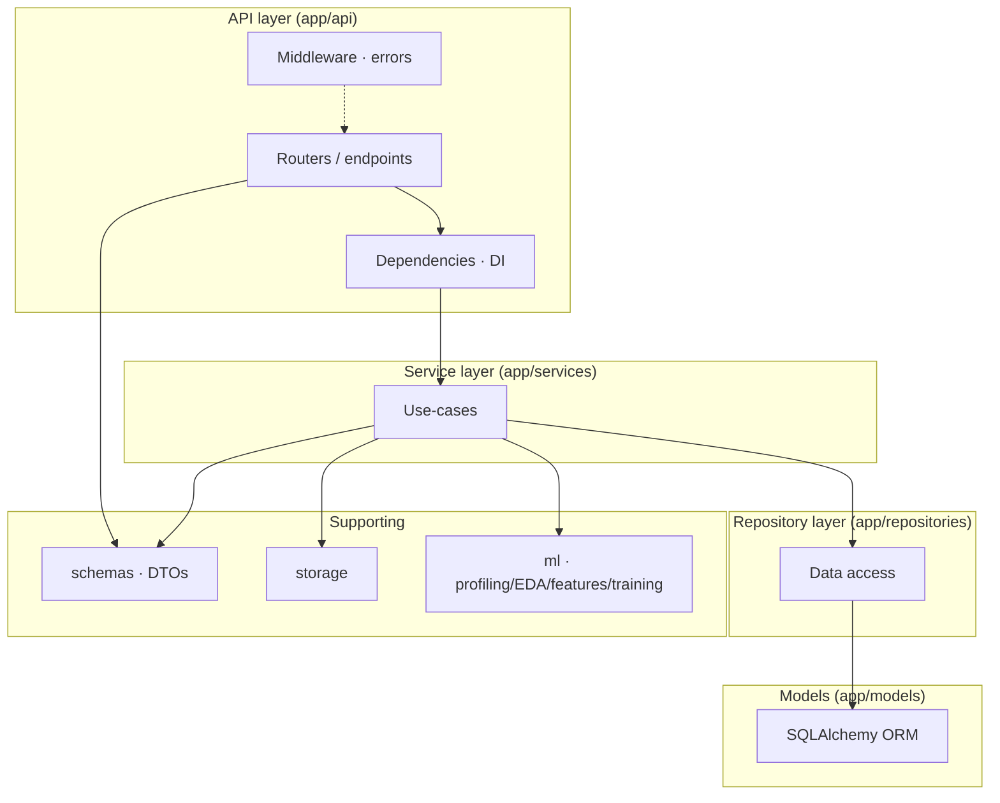
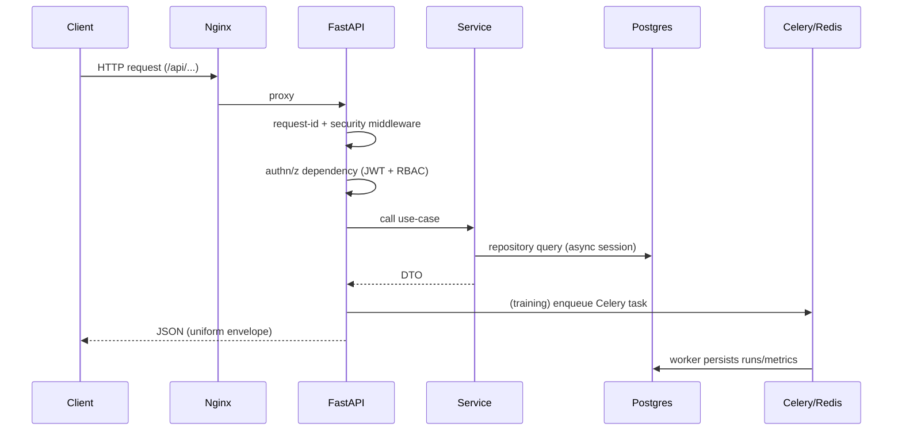

# Architecture

The platform follows **Clean Architecture** with the dependency rule pointing
inward: the API depends on services, services depend on repositories, and
repositories depend on the ORM models. Cross-cutting concerns (config, logging,
security) live in `core`, and the framework-agnostic ML logic lives in `ml`.

## Layers

**The dependency rule:** arrows point inward. An endpoint never touches the ORM
directly; it calls a service, which orchestrates repositories and domain logic.
This keeps business rules independent of FastAPI and SQLAlchemy, and makes every
collaborator overridable in tests.

## Request lifecycle

## Asynchronous training

Training is CPU-bound and can run for minutes, so it never executes inside a
request. The API enqueues a Celery task; a worker builds its own async session
and drives the shared `ExperimentService.run_experiment` orchestration — a single
code path used by both inline (test) and worker (production) execution.

## Key design decisions

- **Repository pattern** — a generic async `BaseRepository` provides pagination,
  filtering, sorting, search and a soft-delete hook; concrete repositories add
  only aggregate-specific queries.
- **Uniform error envelope** — every error (domain, validation, HTTP, unexpected)
  is rendered as one JSON shape with a correlation id.
- **Graceful ML degradation** — optional native libraries (XGBoost/LightGBM/
  CatBoost) are imported defensively; a missing library simply drops that
  algorithm from the registry.
- **Reproducibility** — datasets are immutably versioned; an experiment always
  references the exact version it trained on, and the fitted preprocessing +
  estimator pipeline is persisted together to eliminate training/serving skew.
