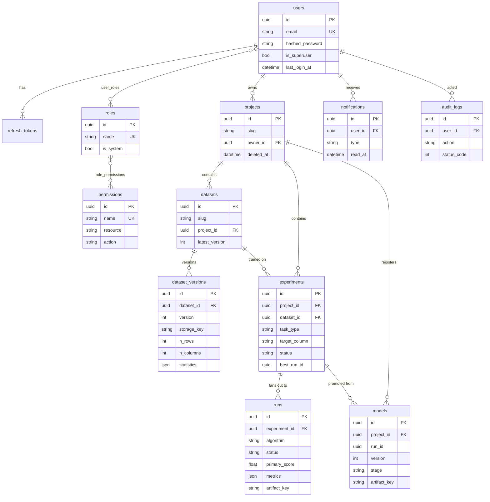

# Database schema

PostgreSQL is the system of record. The schema is managed by Alembic; the initial
migration creates every table below. All primary keys are UUIDs and every table
carries `created_at` / `updated_at` audit timestamps.

## Entity–relationship diagram

## Notes

- **RBAC** — `users` acquire capabilities through `roles`; roles bundle
  `permissions` (`resource:action`). Nothing grants a permission to a user
  directly.
- **Soft deletes** — `projects`, `datasets` and `models` carry a nullable
  `deleted_at`; repositories exclude soft-deleted rows from every read.
- **Immutable versions** — `dataset_versions` and registered `models` are never
  mutated in place, underpinning reproducibility.
- **`experiments.best_run_id`** is an unconstrained UUID (not a foreign key) to
  avoid a circular dependency with `runs.experiment_id`; integrity is enforced in
  the service layer.
