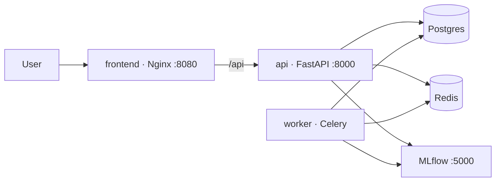

# Deployment

The reference deployment is the Docker Compose stack in `docker-compose.yml`.

## Services

| Service | Image | Notes |
|---------|-------|-------|
| `db` | `postgres:16-alpine` | Named volume, healthcheck |
| `redis` | `redis:7-alpine` | Broker + result backend |
| `mlflow` | backend image | Tracking server on :5000 |
| `api` | backend image | Runs migrations + seeding on start, Gunicorn/Uvicorn |
| `worker` | backend image | Celery worker |
| `frontend` | Nginx | Serves the SPA, reverse-proxies `/api` |

## Configuration

All configuration is via environment variables (see `.env.example`). The
**required** values are:

- `SECRET_KEY` — a long random string (`python -c "import secrets; print(secrets.token_urlsafe(64))"`)
- `FIRST_SUPERUSER_EMAIL` / `FIRST_SUPERUSER_PASSWORD`
- `POSTGRES_PASSWORD`

## Start-up sequence

1. `db` and `redis` become healthy.
2. `api` runs `scripts/entrypoint.sh`: waits for the DB → `alembic upgrade head`
   → `python -m app.db.init_db` (idempotent seeding) → Gunicorn.
3. `worker` waits for the DB and starts consuming the `training` queue.
4. `frontend` serves the built SPA and proxies API calls to `api`.

Migrations and seeding are idempotent, so the entrypoint is safe to run on every
container start (including rolling deploys).

## Production hardening checklist

- Set `ENVIRONMENT=production` (disables docs, enables HSTS).
- Terminate TLS at the edge (Nginx/ingress) and set `BACKEND_CORS_ORIGINS` to the
  real frontend origin(s).
- Use managed Postgres and Redis; point `POSTGRES_*` / `REDIS_*` at them.
- Replace the local object storage (`STORAGE_ROOT`) with an S3-backed
  implementation of the `Storage` interface.
- Scale `worker` horizontally for training throughput; scale `api` replicas
  behind the proxy.
- Ship logs (structured JSON) and metrics to your observability stack.

## CI/CD

GitHub Actions run on every push/PR (`.github/workflows`):

- **Backend CI** — Ruff, Black, mypy, pytest (with coverage) and a migration
  apply against a real Postgres service.
- **Frontend CI** — type-check, ESLint, Vitest and a production build.
